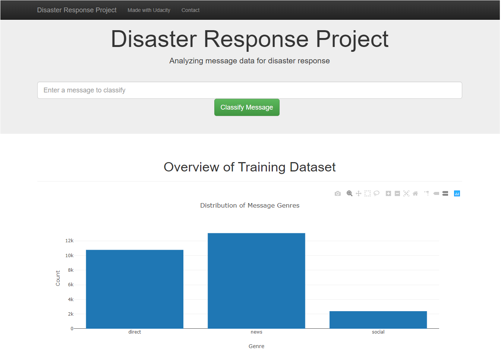

<h1>Data Scientist Nanodegree (Udacity)</h1>
<h1>Disaster Response Pipeline Project</h1>

<h3>Installation:</h3, alt="Prediction page">

This project requires Python 3.x and the following Python libraries:

<ul>
    <li>pandas</li>
    <li>scikit-learn</li>
    <li>NLTK</li>
    <li>SQLAlchemy</li>
    <li>Plotly</li>
    <li>Flask</li>
</ul>

<h3>Data:</h3

The data in this project comes from Figure Eight - Multilingual Disaster Response Messages.

This dataset contains 30,000 messages drawn from events including an earthquake in Haiti in 2010, an earthquake in Chile in 2010, floods in Pakistan in 2010, super-storm Sandy in the U.S.A. in 2012, and news articles spanning a large number of years and 100s of different disasters.

The data has been encoded with 36 different categories related to disaster response and has been stripped of messages with sensitive information in their entirety.

Data includes 2 csv files:

<ul>
    <li>disaster_messages.csv: Messages data.</li>
    <li>disaster_categories.csv: Disaster categories of messages.</li>
</ul>

### Folder Structure

- app  
| - templates   
| |- master.html  # main page of web app  
| |- go.html  # classification result page of web app  
|- run.py  # Flask file that runs app  
  
- data  
|- disaster_categories.csv  # data to process  
|- disaster_messages.csv  # data to process  
|- process_data.py  
|- DisasterResponse.db   # database to save clean data to  
  
- models  
|- train_classifier.py  
|- classifier.pkl  # saved model  
  
- notebook  
|- ETL Pipeline Preparation.ipynb  
|- ML Pipeline Preparation.ipynb  
  
- screenshot  
|- Home.png  
|- Prediction page.png  
  
- README.md  

### Instructions:
1. Run the following commands in the project's root directory to set up your database and model.

    - To run ETL pipeline that cleans data and stores in database
        `python data/process_data.py data/disaster_messages.csv data/disaster_categories.csv data/DisasterResponse.db`
    - To run ML pipeline that trains classifier and saves
        `python models/train_classifier.py data/DisasterResponse.db models/classifier.pkl`

2. Run the following command in the app's directory to run your web app.
    `python run.py`

3. Go to http://0.0.0.0:3001/
